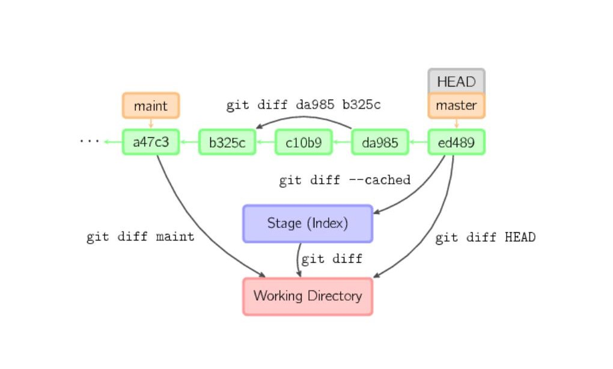

[< содержанию](./readme.md)

## 
 *Отличия между деревьями проекта; коммитами; состоянием индекса и каким-либо коммитом.* (***git diff***) 

Своего рода подмножеством команды ***git log*** можно считать команду ***git diff***, определяющую изменения между объектами в проекте: деревьями (файлов и
директорий):

***git diff*** — покажет изменения, не внесенные в индекс.

***git diff --cached*** — изменения, внесенные в индекс.

***git diff* HEAD** — изменения в проекте по сравнению с последним коммитом

***git diff* HEAD^** — предпоследним коммитом

Можно сравнивать «головы» веток:

***git diff master..experimental***

Ну или активную ветку с какой-либо:

***git diff experimental***

Источник: https://habr.com/ru/post/60347/