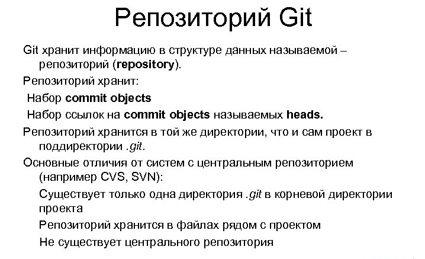

[< содержанию](./readme.md)

## 
 *Что такое репозиторий?* 

__Репозиторием__ называют хранилище вашего кода и историю его изменений. ***Git*** работает локально и все ваши репозитории хранятся в определенных папках на жестком диске.

Источник: https://habr.com/ru/post/541258/